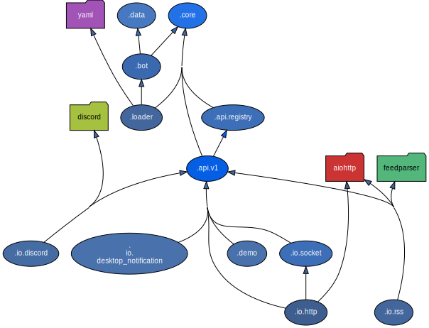

<!--
SPDX-FileCopyrightText: 2021 - 2023 Mewbot Developers <mewbot@quicksilver.london>

SPDX-License-Identifier: CC-BY-4.0
-->

# MewBot

[](CODE_OF_CONDUCT.md)

<!-- ALL-CONTRIBUTORS-BADGE:START - Do not remove or modify this section -->
[](CONTRIBUTORS.md)
<!-- ALL-CONTRIBUTORS-BADGE:END -->

[](https://github.com/mewler/mewbot/actions/workflows/review.yaml)

[](https://sonarcloud.io/summary/new_code?id=mewler_mewbot)

MewBot is an automation framework intended to simplify building cross-platform text/chat-bots.
The design is intended to be modular with configuration separated from code,
allowing users and developers to build out custom logic and behaviours with
minimal coding experience.

### Status

| WARNING: This project is still in the very early stages. |
| --- |

Some basic bots can be built and run, but we currently consider all parts of the framework to be unstable.

### Packages and Modules

The codebase represents both the base API used to build components for the bot,
as well as an implementation of the runtime to actually execute a bot.
As such, it is built and published as a group of packages.

| Package       | Modules         | Description                                                                                                                                |
|---------------|-----------------|--------------------------------------------------------------------------------------------------------------------------------------------|
| `mewbot`      | `mewbot`        | Tools to load a bot, and run that bot.                                                                                                     |
| `mewbot-core` | `mewbot.core`   | Base interfaces for all modules                                                                                                            |
| `mewbot-api`  | `mewbot.api.v1` | Development libraries + component registry system. This is the package that all 3rd party libraries should depend on for their interfaces. |
| `mewbot-io`   | `mewbot.io.*`   | The bindings to connect MewBot to a given service.                                                                                         |
| `mewbot-test` | `mewbot.tests`  | Utilities for writing tests for MewBot modules.                                                                                            |





These packages are generated by some trickery in [`setup.py`](./setup.py).


Each package also defines its own requirements list. Installing `requirements-dev.txt`
will include all of these automatically.


### Development


Contributions to the project are made via GitHub pull requests, which will
enforce the code style and linting requirements of this project.

#### Setting up project for local development
[//]: # (This section is under development)


The recommended way to set this project up is using python 3.9 (or higher) with
a standard `venv` setup.
The project uses a "src-dir" layout; for Python to be able to locate the modules, 
you will need to set up the `PYTHONPATH` environment variable with at least the `src/` directory.

For convenience in POSIX-like systems, an importable script `./tools/path`
is provided that will return the appropriate path.

The following example will get you started in POSIX-like shells (sh, bash, zsh, etc.).

```shell
# Get the source code
git clone git@github.com:mewler/mewbot
cd mewbot

# Set up the virtual environment
python3 -m venv venv
printf '. ./tools/path\n' >>venv/bin/activate

# Activate the virtual environment
source venv/bin/activate

# Install all dependencies (including development dependencies)
pip install -r requirements-dev.txt

# Run a demo!
python3 -m examples examples/trivial_socket.yaml
```

#### Running the tests and linters

You can run the linters via the convenience script `./tools/lint` or with
`python -m mewbot.tools.lint`
This runs the auto-formatter `black`, two opinionated linting tools in `flake8`
and `pylint`, and the `mypy` type checker in strict mode.

You can run the test framework using the convenience script `./tools/test`
or with `python -m mewbot.tools.test`.
Locally this will default to running all tests in parallel for fast testing.
You can add the flag `--cov` to enable coverage, which will output coverage information
both to the terminal and store details of code coverage as webpages in `coverage/`.

More information on the linters and tests can be found in the
[contributor documentation](./CONTRIBUTING.md).

